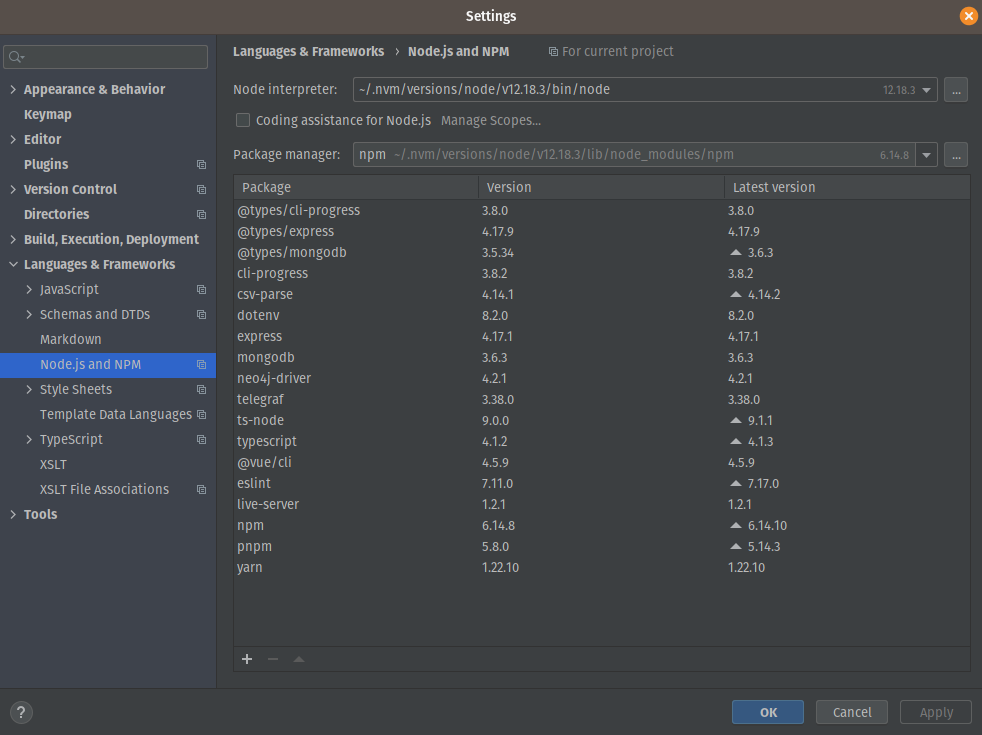
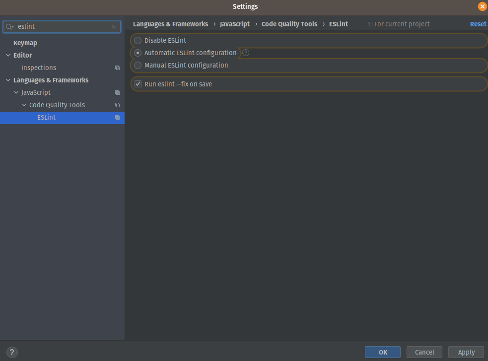

# MAC example Telegram bot project

This example comes in both flavor, either Javascript or Typescript on Nodejs. Both perform exactly the same.
- javascript code is located in `/src`

## Deploying
We'll first take care of deploying on your computer. This bot uses both Neo4j and MongoDB for data persistance. We provide
a `docker-compose.yml` file for your convenience.

### Using docker
If you want to use docker, make sure it is installed on your machine, and then run `docker-compose up` to start both Mongodb and Neo4j

### Filling some data
- Create a `.env` file based on the `.env.exemple` provided file and fill in `DOCUMENTDB_HOST` and `GRAPHDB_HOST`.
- To fill in some data, we provide a script which loads some stuff:
  - In javascript (`/src/loadData.js`), run `npm run import` to make it run

### Registering the bot
You first have to register it on Telegram, for this follow the [documentation](https://core.telegram.org/bots).
- Register your bot on BotFather
- Register two commands:
  - `help` which provides some help
  - `recommendactors` which tries to recommend actors based on user preferences
- run `/setinline` and `/setinlinefeedback` for the bot to be able to answer inline queries
- copy the token the botfather gave you and go to `https://api.telegram.org/bot<YOUR_TOKEN>/getUpdates`
  to enable active polling on your bot. Don't forget to replace `<YOUR_TOKEN>` by your actual token
 
### Running your bot
You can run the bot either in javascript:
- In javascript (`/src/index.js`) run `npm start`
This will make the bot run in active polling mode, which means the bot will 

## Profit
```bash
docker-compose up -V
# deuxième terminal
npm run import
npm start
```
Normalement, tout est reset à zero
### Eslint + webstorm
ctrl-a > fix eslint problems

Note: specify node version https://www.jetbrains.com/help/idea/node-js-interpreters.html#ws_node_interpreters_dialog_open

Note: fix-on save

